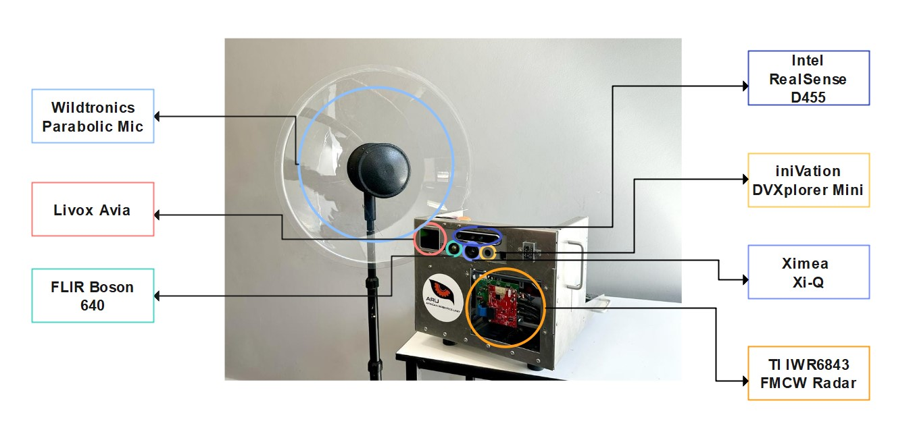

# M2S2 - Multi Modal Sensor SUite 

## Description 



This repo contains [ROS2](https://docs.ros.org/en/foxy/index.html) drivers for various sensors to collect raw, synchronized, high-speed RGB video, stereoscopic depth video, mmWave radar, thermal, event, LiDAR and audio measurements. 

This repo also contains all mechanical designs used, as well as extrinsic calibration data and procedures used in the design of this system. 

In addition, we present the first M2S2 dataset containing wild cheetah behaviour.

<hr/>

## Hardware 
- High-speed RGB Camera: [Ximea -- MQ022CG-CM](https://www.ximea.com/products/usb3-vision-cameras-xiq-line/mq022cg-cm) (Driver: [ximea_ROS2_driver](https://github.com/African-Robotics-Unit/ximea_ROS2_driver))
- RGBD Camera: [Intel RealSense D435i Stereo Camera](https://www.intelrealsense.com/depth-camera-d435i/) (Driver: [realsense_ROS2_driver](https://github.com/African-Robotics-Unit/realsense_ROS2_driver)
- Thermal Camera: [FLIR Boson 640](https://www.flir.eu/products/boson/) (Driver: [flir_boson_ROS2_driver](https://github.com/African-Robotics-Unit/flir_boson_ROS2_driver))
- LiDAR: [Livox Avia](https://www.livoxtech.com/avia) (Driver: [livox_lidar_ROS2_driver](https://github.com/African-Robotics-Unit/livox_lidar_ROS2_driver))
- Radar: [Texas Instruments DCA1000 Raw ADC capture board](https://www.ti.com/tool/DCA1000EVM) (Driver: coming soon)
- Event Camera: [Dynamic Vision iniVation DVXplorer](https://inivation.com/solution/dvp/) (Driver: [dvxplorer_ROS2_driver](https://github.com/African-Robotics-Unit/dvxplorer_ROS2_driver))
- Microphone: [Wildtronics Pro Mono Parabolic Microphone](https://www.wildtronics.com/parabolic.html#.Y3zIiNLP1H4) (Driver: [audio_ROS2_driver](https://github.com/African-Robotics-Unit/audio_ROS2_driver))
- Mini PC: [Intel NUC 13 Pro](https://www.intel.com/content/www/us/en/products/docs/boards-kits/nuc/mini-pcs/nuc-13-pro.html) 

## Prerequisites
- [Ubuntu 20.04 LTS](https://releases.ubuntu.com/focal/) 
- [ROS2 foxy](https://docs.ros.org/en/foxy/Installation.html)
  
- For dependencies of specific drivers, please refer to the corresponding README file. 

## Setup

### ROS2 Foxy
For ROS2 installation, please refer to the official ROS2 installation guide: [ROS2-foxy installation guide](https://docs.ros.org/en/foxy/Installation.html)

### RMW-ecal
Using [eCAL RWM](https://github.com/eclipse-ecal/rmw_ecal) as an alternative to ROS2 DDS middleware implementations showed significant perfomance improvements.

Install [eCAL](https://eclipse-ecal.github.io/ecal/getting_started/setup.html)
```bash
$ sudo add-apt-repository ppa:ecal/ecal-latest
$ sudo apt-get update 
$ sudo apt-get install ecal
```

Clone the latest release of the [ecal-rmw](https://github.com/eclipse-ecal/rmw_ecal) repository into your ROS2 workspace and build it. 

```bash
$ cd ~/ros2_ws
$ git clone https://github.com/eclipse-ecal/rmw_ecal.git
$ cd ~/ros2_ws/rmw_ecal
$ colcon build --packages-skip rmw_ecal_proto_cpp
$ vim ~/.bashrc   # add "source ~/ros2_ws/rmw_ecal/install/setup.bash"
$ source ~/.bashrc
```

Add the following line into your `.bashrc` to run all nodes using eCAL middleware
```bash
export RMW_IMPLEMENTATION=rmw_ecal_dynamic_cpp
```

## Build 


## Usage


## Deserialise Data 
Using the eCAL RMW, one can record data using their powerful[recording](https://eclipse-ecal.github.io/ecal/getting_started/recorder.html) tool. All data is stored as an ecal_measurement in .hdf5 files. 

Our [m2s2_ecal_deserializers](m2s2_ecal_deserializers) provides deserializers to convert raw M2S2 measurements into readable data.  


